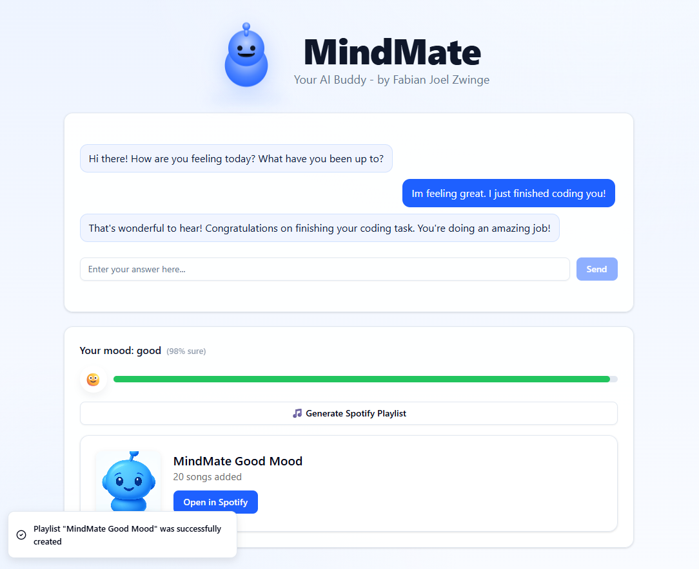
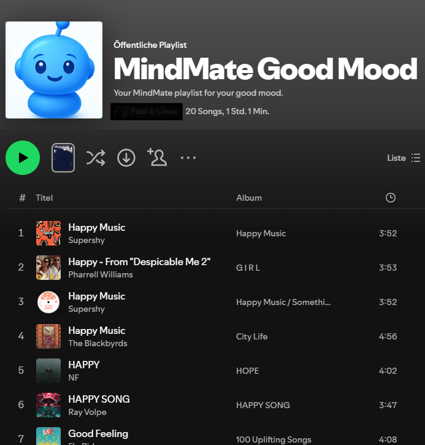

# 💬 MindMate

**MindMate** is your personal AI companion that checks in with you every day and asks:

> *“Hi there! How are you feeling today? What have you been up to?”*

You can respond freely, and the integrated **sentiment analysis** automatically detects your mood.  
Based on your emotional state, MindMate generates **Spotify playlists** that reflect how you're feeling.

👉 **Try it out yourself:**  
https://mindmate-frontend-ns1v.onrender.com

---

## 📸 How the app looks...

Below are examples of how MindMate reacts to different emotional inputs and generates matching Spotify playlists.

---

### 😄 Good Mood

When the user writes a **positive message**, MindMate detects a good mood and responds accordingly.  
In this case, the app offers to generate a **happy, upbeat Spotify playlist** filled with energetic and cheerful songs.

After confirming, a **positive playlist** is generated and displayed directly in the app.

The playlist can then be opened in Spotify, allowing the user to enjoy music that matches their current mood.

---

### 😐 Neutral Mood

If the message expresses a **neutral emotional state**, MindMate classifies the mood accordingly and responds in a balanced, supportive way.

---

### 😔 Bad Mood

When a **negative or emotionally difficult message** is detected, MindMate recognizes a bad mood and responds with empathy.

---

## 📝 Note

- Only **English** is supported.  
- The application is hosted on the **Render Free Plan**. Once the allocated free usage hours are exhausted, the backend service, model API service, and frontend may be suspended until the end of the month.

---

## 🛠️ Prerequisites for Local Development

- **Python 3.13+**
